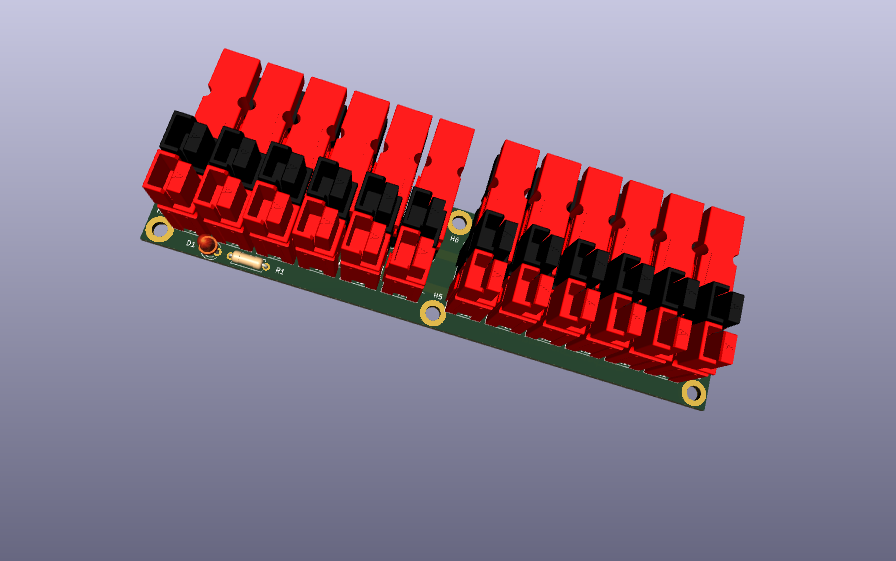
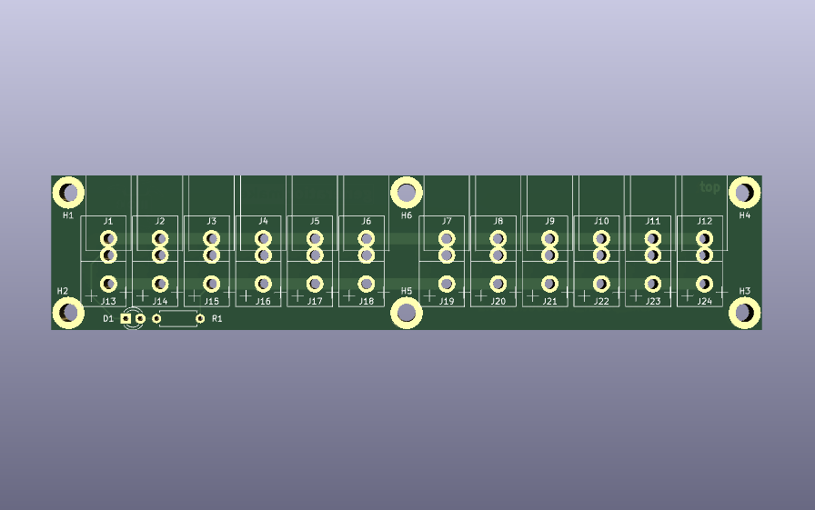
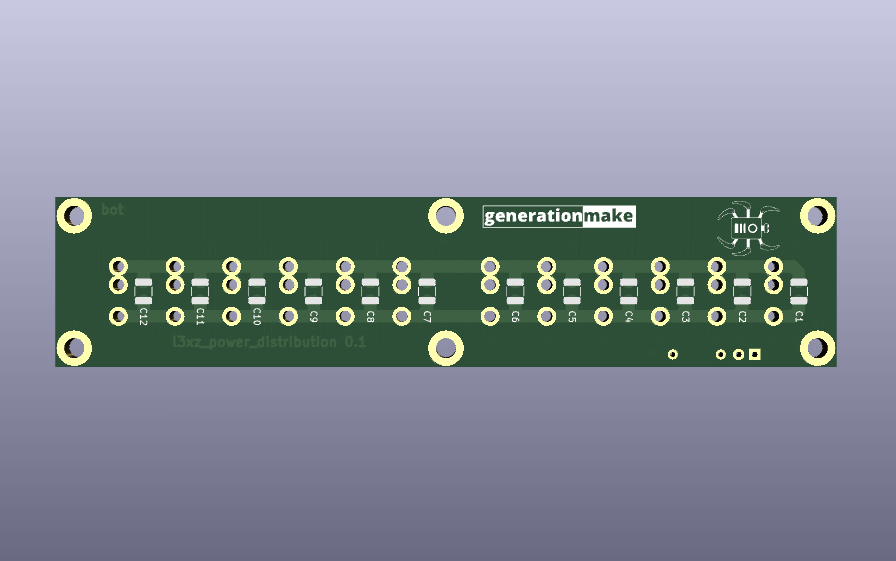

`l3xz_power_distribution`
========================

power distribution board with power pole connectors for the [L3X-Z Hexapod](https://github.com/107-systems/l3xz-hw)

  

  </a>

## PCB
### Top

  </a>

### Bottom

  </a>

